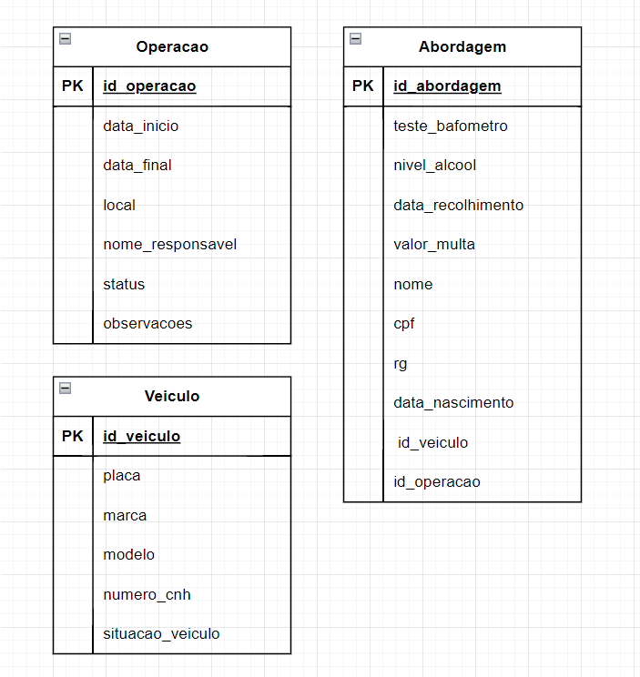

# ADR 002 - Decisão de Arquitetura seguindo os padrões do Clean Architecture

### Submissores

Jamille dos Santos Monteiro

## Registro de alterações

12-01-2025 - Aprovado - Proposta inicial da decisão de arquitetura para o sistema.

## Contexto

Nesta aplicação, o Clean Architecture foi adotado para organizar o sistema em camadas independentes e bem definidas. Essa estrutura permite que a lógica de negócio seja centralizada na camada Core, enquanto a interação com fontes externas é tratada em Data, e a interface com o usuário é gerenciada em Presentation. Assim, o sistema mantém-se flexível, modular e preparado para mudanças futuras.

## Projeto Proposto

A aplicação está estruturada em quatro camadas principais: Core, Data, Domain e Presentation. Cada camada desempenha um papel específico e interage com outras de maneira bem definida.

### Camadas da Arquitetura

1. Core

   - Entities
     - Representam as entidades principais do sistema, encapsulando as regras de negócio específicas ao domínio.
   - UseCases
     - Casos de uso da aplicação, implementando a lógica de negócio de alto nível.

2. Data

   - Repositories
     - Implementações concretas dos repositórios definidos na camada Domain.
   - DataSource
     - Responsável por acessar os dados diretamente da minha API.

3. Domain

   - Models
     - Modelos que representam os dados manipulados pela aplicação, mas sem regras de negócio.
   - Repositories
     - Interfaces que definem como a aplicação interage com os dados.

4. Presentation

   - A camada Presentation é responsável pela interação com o usuário.

### Fluxo de Dados

1. Usuário interage com a interface (Presentation):

- O usuário realiza uma ação, como clicar em um botão ou enviar um formulário.

2. Casos de Uso são acionados (Core):

- A camada Presentation aciona os UseCases da camada Core, que contêm a lógica de negócio.

3. Repositórios e Fontes de Dados (Data & Domain):

- Os UseCases interagem com os Repositories, que delegam a busca ou persistência dos dados para os DataSources.

4. Resultados Retornados:

- Os dados são retornados à camada Presentation, que atualiza a interface do usuário.

### Diagrama do Banco de Dados

